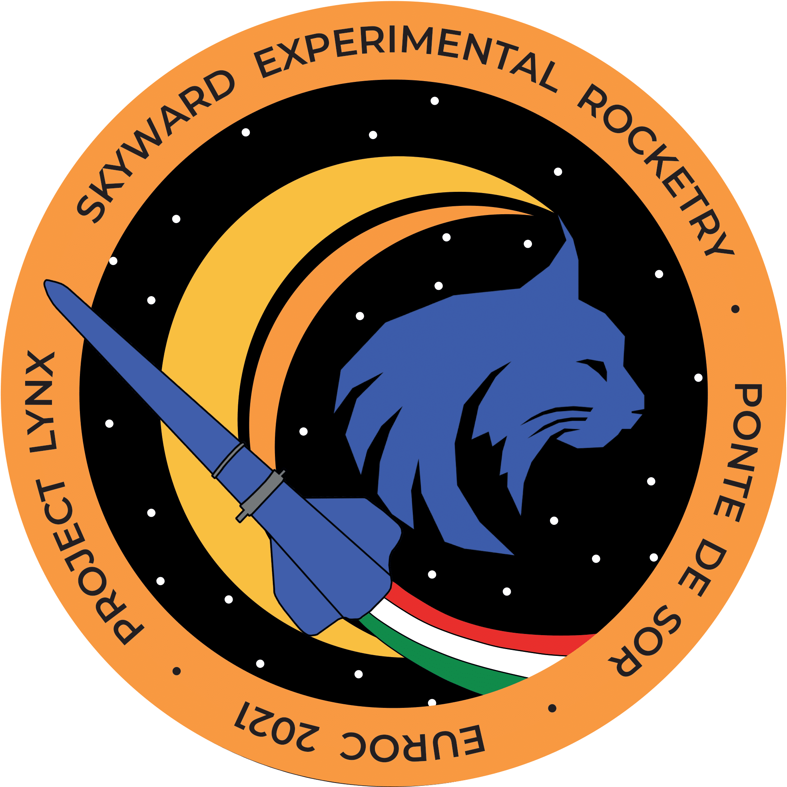

# Lynx On-Board Software

The on-board software represents the top layer of the rocket's firmware.

This includes all the logics needed for a successful flight: multiple finite state machines are implemented here, along with control algorithms (attitude estimation, apogee detection and airbrakes controller). 

This level also handles all the commands received from the ground station and sends telemetry data.

## Folders structure

|   Folder                  |   Content                                                         |
| ------------------------- | ----------------------------------------------------------------- |
| src/boards/               | Classes and components, divided by board.                         |
| src/entrypoints/          | Each file here is a "*main*" to be built with SBS.                |
| src/tests/                | Tests that can be built with SBS.                                 |
| src/mocksensors/          | Collection of mock sensors for testing with previous flights data.|
| src/hardware_in_the_loop/ | Framework for testing in a "hardware-in-the-loop" fashion.        |
| [skyward-boardcore/](https://github.com/skyward-er/skyward-boardcore)        | Provides the build system (SBS) and common drivers.               |
| bin/                      | Compiled binaries generated by SBS, to be flashed on boards.      |
| build/                    | MIOSIX Makefiles generated by SBS (*not important*)               |
| obj/                      | Building stuff (*not important*)                                  |

## Getting Started
To clone, use `git clone --recurse-submodules https://github.com/skyward-er/on-board-software.git`.

To build, use `sbs` (for more info, type `./sbs --help` on Linux or `sbs --help` on Windows).
#### Test Suite
Interactive entrypoint to test various aspects of the DeathStack hardware and software: `src/entrypoints/death-stack-x-testsuite.cpp`

| Test              | Description                                              |
| ----------------- | -------------------------------------------------------- |
| Test power board  | Allows to test battery voltage, cutters and servo motors |
| Test stm board    | Allows to test leds and external oscillator              | 
| Test rf board     | Allows to test the radio module, IMUs, GPS and SD Card   |
| Test analog board | Allows to test the pressure sensors and detachment pins  |

#### Flight Entry
Main entrypoint used for flight: `src/entrypoints/death-stack-x-entry.cpp`
